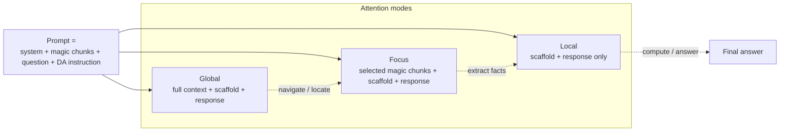
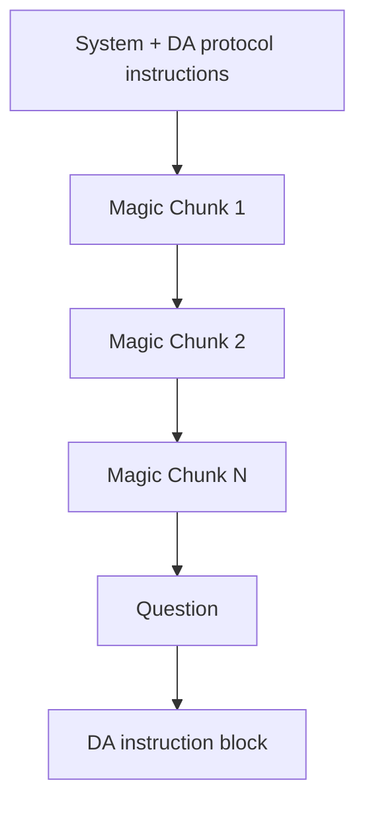
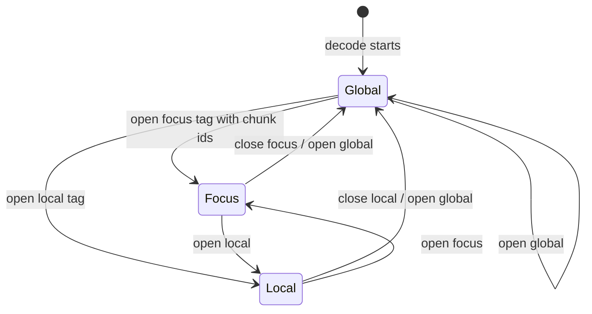
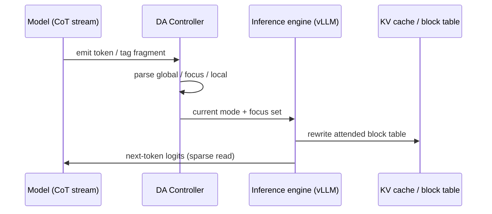

# Declarative Attention

**Full title:** Language Models Can Control Their Own Attention  
**Authors:** Namgyu Ho\*, Huzama Ahmad\*, Woosung Koh\* (KAIST AI); Se-Young Yun† (KAIST AI); Tal Schuster†, Cicero Nogueira dos Santos† (Google DeepMind)  
\* Equal contribution · † Corresponding authors  
**arXiv:** [2609.02737](https://arxiv.org/abs/2609.02737) · **PDF:** [arxiv.org/pdf/2609.02737](https://arxiv.org/pdf/2609.02737)  
**Published:** September 2, 2026 (arXiv v1)

> Google co-authors performed only an advisory role. Companion short summary: [`SUMMARY.md`](SUMMARY.md). Resources: [`RESOURCES.md`](RESOURCES.md).

---

## Problem / motivation

Transformers re-read the **entire KV cache** at every decode step, even though attention mass concentrates on a small slice of context. In long-context regimes that memory traffic dominates latency (e.g., ~15 GB of KV per step at 1M tokens for a large MoE).

Extrinsic sparse-attention methods use **proxy scores** to guess relevant tokens, but still pay **O(N)** per step to scan the cache. The authors ask: *wouldn't the model already know which parts of the context are relevant?*

**Declarative Attention (DA)** turns that intuition into a protocol: the model **declares** where it needs to look inside its chain-of-thought, and the inference engine skips the rest of the KV read.

---

## Method and architecture

DA is a **zero-shot protocol** (no weight updates). The model emits parseable tags in its CoT; a decode-time controller treats them like tool calls and rewrites which KV blocks are visible.

### Three attention modes

| Mode | Tag | What is attended |
|------|-----|------------------|
| **Global** | `<global>…</global>` | Full context (navigation / locating relevant segments) |
| **Focus** | `<focus magic_chunks="K">…</focus>` | Named context segment(s) only |
| **Local** | `<local>…</local>` | Recent model output only (no long-context segments) |

The **scaffold** (system, question, instruction) and the **response so far** stay visible in every mode; only the long-context **magic chunks** are gated.



### Prompt structure: magic chunks

Long inputs are partitioned into ~2K-token addressable **“magic chunks”** with explicit headers (`Magic Chunk 1`, `Magic Chunk 2`, …). The model names chunk ids in `<focus magic_chunks="2,7">` the same way it would name tool arguments.



### Decode-time state machine / inference engine flow

The controller **starts in global**. Opening tags transition the mode; closing tags revert to global (paper §2.3). Masking is **block-aligned** (vLLM KV blocks, typically 16–32 tokens) so FlashAttention-style kernels can skip whole blocks. Integrated via vLLM attention-metadata hooks (no custom kernels).





Unlike proxy-scorer sparse attention, DA incurs full-context reads only during declared **global** spans—not as a fixed per-step overhead.

---

## Key design decisions (from the paper)

1. **Declare in the CoT, not via an auxiliary scorer.** The model already plans what to read; surfacing that plan as tags avoids a second model and keeps the protocol inspectable.
2. **Magic chunks (~2K tokens).** Named, addressable segments give the model a stable vocabulary of “places to look,” analogous to tool argument ids.
3. **Scaffold always visible.** System / question / instruction stay in the attended set so the model does not lose the task when focusing.
4. **Block-aligned masking.** Aligning masks to KV blocks preserves FlashAttention efficiency; whole blocks are skipped rather than scattering fine-grained masks.
5. **Zero-shot baseline.** No fine-tune required for a usable lower bound; training for DA is left as future headroom.
6. **Parse tags like tool calls.** The same infrastructure that handles function calling can drive attention metadata each step.
7. **Dynamic mask is essential.** Prompting alone (DA-nm) can *increase* attended tokens by lengthening generations; the mask is what drives savings.

---

## Paper results (real numbers)

Zero-shot evaluation across **15 long-context tasks** on off-the-shelf models:

| Model | Attended-token reduction | Accuracy drop |
|-------|--------------------------|---------------|
| **Gemma-4-31B** | **52.0%** (13.43M → 6.45M avg attended tokens/response) | **1.27pp** (87.01% → 85.74%) |
| **Qwen-3.6-27B** | **31.1%** (22.54M → 15.52M) | **2.75pp** (85.31% → 82.56%) |

Additional findings:

- **Scaling:** Relative accuracy under DA rises with size (e.g., ~29% of vanilla at Gemma-4-E4B → ~99% at Gemma-4-31B; ~64% at Qwen-3.5-4B → ~97% at Qwen-3.6-27B). Protocol adherence (valid focus chunk refs) reaches ~99% at the largest models.
- **Mask ablation (DA-nm):** Prompting alone lengthens generations; the dynamic mask drives savings (up to **71.1%** fewer attended tokens vs maskless DA on Gemma).
- **Mode mix (Gemma-4-31B):** ~27% of generated tokens in `<global>`; `<focus>` / `<local>` (~73%) attend ~12% / ~6% of vanilla tokens per step on average.
- **Wall-clock projection (roofline):** decode cost → **0.71×** (Gemma-4-31B) and **0.77×** (Qwen-3.6-27B) of vanilla on a well-optimized stack.

---

## How this repo maps onto the paper

| Paper piece | Our code |
|-------------|----------|
| Mode tags + parsing | `src/da/modes.py` |
| Magic-chunk partitioning | `src/da/chunking.py` |
| Decode-time state machine + attended-set logic | `src/da/controller.py` |
| Vanilla vs DA attended-token accounting | `src/da/metrics.py` |
| DA system / instruction templates | `src/da/prompting.py` |
| Educational Acme CoT simulator (stdlib) | `demos/cpu_protocol_demo.py` |
| Smoke / longctx GPU drivers + YAML | `experiments/` |
| RunPod setup / run wrappers | `runpod/` |
| Resource table generator | `scripts/estimate_resources.py` |

**Honest scope:** the CPU demo fully simulates protocol + projected savings. GPU paths load **Qwen2.5-7B-Instruct**, generate with transformers/vLLM, parse tags, and log adherence + **projected** attended-token savings from the controller. Full vLLM attention-metadata block masking (paper serving stack) is scaffolding you can extend—metrics remain meaningful for protocol adherence even when the underlying attention is still dense.

---

## Base model choice

**Default: [`Qwen/Qwen2.5-7B-Instruct`](https://huggingface.co/Qwen/Qwen2.5-7B-Instruct).**

Rationale: long enough context for DA chunking, fits a single 24–48GB GPU with transformers/vLLM, and stronger protocol adherence than tiny models—without requiring the paper’s 27B–31B class for a practical smoke test. Heavier alt: `Qwen/Qwen2.5-14B-Instruct` on A100 80GB (see [`RESOURCES.md`](RESOURCES.md)).

---

## Layout

```
papers/declarative-attention/
  SUMMARY.md              # short companion summary
  README.md               # this document
  RESOURCES.md            # GPU / VRAM / wall-time table
  requirements.txt
  pyproject.toml
  src/da/                 # protocol library
  demos/cpu_protocol_demo.py
  experiments/            # configs + bash drivers
  runpod/                 # pod setup / run wrappers (examples for create/stop)
  scripts/estimate_resources.py
  artifacts/              # JSONL + metrics (gitignored locally as needed)
```

---

## Local CPU demo (always safe)

```bash
cd papers/declarative-attention
bash experiments/run_cpu_demo.sh
# or: python demos/cpu_protocol_demo.py
```

Prints mode spans for a scripted Acme Corp CoT and token-read savings vs vanilla full attention.

Dry-check a GPU config without loading weights:

```bash
DRY_CONFIG_CHECK=1 bash experiments/run_smoke.sh
python scripts/estimate_resources.py
```

---

## RunPod command sequence (smoke)

Do **not** auto-create paid pods. When you intentionally want GPU spend:

```bash
# 0) (optional, EXAMPLE only) edit then run:
#    bash runpod/00_create_pod.example.sh

# 1) On the pod — install deps / HF check
bash runpod/01_setup_env.sh

# 2) Sync code from laptop if needed
bash runpod/02_sync_code.sh   # prints rsync hints

# 3) Smoke experiment (Qwen2.5-7B-Instruct)
bash runpod/03_run_smoke.sh

# 4) Optional long context
bash runpod/04_run_longctx.sh

# 99) Stop when done (EXAMPLE — edit POD_ID)
#    bash runpod/99_stop_pod.example.sh <POD_ID>
```

Equivalent direct drivers:

```bash
bash experiments/run_smoke.sh
bash experiments/run_longctx.sh
```

If CUDA is missing, GPU scripts **exit with a clear message** (they never silently pretend a GPU run succeeded). Use the CPU demo locally instead.

Artifacts land under `artifacts/` as JSONL + metrics JSON.

---

## Sources

- Abstract: https://arxiv.org/abs/2609.02737  
- PDF: https://arxiv.org/pdf/2609.02737  
- See also [`SUMMARY.md`](SUMMARY.md) and [`RESOURCES.md`](RESOURCES.md)
