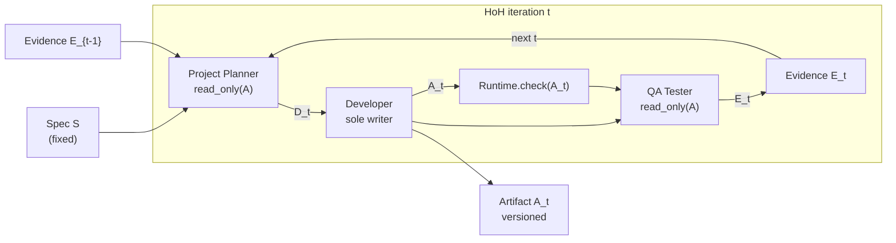
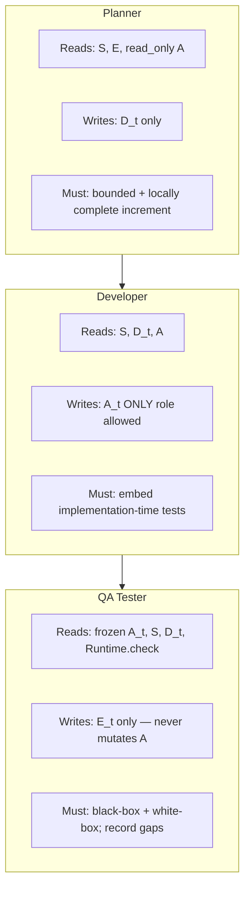
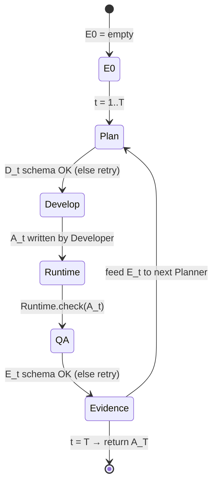

# Harness-of-Harness (HoH)

**Full title:** Harness-of-Harness: Multi-Day Autonomous Software Development with Continual Improvement  
**Authors:** Haoyang Yan†, Min-Le Su†, Hangfan Zhang†, Zhanhao Li†, Chen Zhang, Shao Zhang, Yang Chen, Lei Bai, Shuyue Hu (Shanghai Artificial Intelligence Laboratory)  
† Equal contribution  
**arXiv:** [2609.01481](https://arxiv.org/abs/2609.01481) · **PDF:** [arxiv.org/pdf/2609.01481](https://arxiv.org/pdf/2609.01481)  
**Official code:** [github.com/Flesymeb/HarnessOfHarness](https://github.com/Flesymeb/HarnessOfHarness)  
**Week:** August 31 – September 6, 2026 (DAIR Papers of the Week)

> Companion short summary: [`SUMMARY.md`](SUMMARY.md). Resources: [`RESOURCES.md`](RESOURCES.md).

---

## Problem / motivation

LLM coding agents still mostly run **human-in-the-loop**: people define tasks, steer decisions, and intervene on failures. **Autonomous software development** is harder — given only a fixed high-level specification **S**, agents must plan, implement, integrate, and continually test a growing system over long trajectories.

As trajectories lengthen, agents lose earlier requirements, apply local fixes that break distant constraints, accumulate failed attempts, or oscillate between endless repair and premature “done.” HoH’s claim: the missing piece is not “more tools,” but a **continual-improvement loop** around an existing coding harness.

---

## Method and architecture

HoH wraps an existing coding-agent **harness** and organizes execution into iterative **Planner → Developer → QA Tester** loops. Across loops there are two states: artifact **A_t** and evidence **E_t**. Spec **S** is fixed.

### Algorithm 1 (paper)

```
Input:  S, A0, budget T
E0 ← ∅
for t = 1 .. T:
  Dt ← ProjectPlanner(S, E_{t-1}; read_only(A_{t-1}))
  At ← Developer(A_{t-1}; S, Dt)
  Et ← QATester(read_only(At); S, Dt, Runtime.check(At))
return A_T
```



### Role contracts



### State transition



---

## Key design decisions (from the paper)

1. **Balance repair vs capability growth.** Each plan must fix outstanding problems *and* deliver a small new capability so the loop does not collapse into endless local repair.
2. **Small, verifiable increments.** Bound the change surface; keep the increment locally complete enough to be testable.
3. **Separate implementation-time testing from independent QA.** Developer embeds focused tests; QA evaluates a **frozen** candidate independently.
4. **Constrain verifiable OUTPUT schemas, not workflows.** Invalid `D_t` / `E_t` (or patches) trigger retries; agents stay free over reasoning and tool use.
5. **Progressive disclosure** of artifacts, role-specific tools, and skills — concise indexes first, details on demand — instead of stuffing full history into context.
6. **Encourage reuse** of existing resources rather than recreating standard capabilities.
7. **Versioned project histories** at role and iteration levels; recover from major regressions.
8. **Single-writer:** only the Developer may modify the artifact; Planner and QA receive **read-only** copies.

---

## Paper results (real numbers)

After **3 iterations**, HoH vs standalone harnesses — average relative gain **52.25%**, maximum **82.86%**.

| Benchmark | Codex + GPT-5.5 | OpenCode + DeepSeek-V4-Pro | Pi + MiniMax-M3 |
|-----------|-----------------|----------------------------|-----------------|
| **GameCraft Overall** | 49.58 → **71.52** (+21.93) | 26.90 → **48.98** (+22.08) | 42.16 → **58.78** (+16.62) |
| **FrontierSWE Dominance** | 44% → **71%** (+27) | 25% → **44%** (+19) | 35% → **64%** (+29) |
| **ProgramBench pass rate** | 60.41 → **66.50** | 45.27 → **57.56** | 35.83 → **52.68** |

Multi-day open-ended run: **70+** iterations producing the FPS game **Fusepoint** (storyline, combat, HUD, audio/VFX polish).

Harness–model pairs in the paper: **Codex+GPT-5.5**, **OpenCode+DeepSeek-V4-Pro**, **Pi+MiniMax-M3**.

---

## How this repo maps onto the paper

| Paper piece | Our code |
|-------------|----------|
| Algorithm 1 outer loop | `src/hoh/loop.py` |
| DevelopmentPlan / EvidenceReport schemas + retries | `src/hoh/schemas.py` |
| Role prompts (Planner / Developer / QA) | `src/hoh/prompts.py` |
| Role runners + patch parse | `src/hoh/roles.py` |
| Single-writer store, snapshots, read-only copies | `src/hoh/artifacts.py` |
| Runtime.check (compile / import / tests) | `src/hoh/runtime.py` |
| Pass-rate / relative-gain helpers + paper citations | `src/hoh/metrics.py` |
| MockLLM CPU demo (T=3) | `demos/cpu_loop_demo.py` |
| Mini ProgramBench-style task | `tasks/mini_cli_todo/` |
| GPU driver + YAML | `experiments/` |
| RunPod setup / run wrappers | `runpod/` |
| Resource table generator | `scripts/estimate_resources.py` |

**Honest scope:** the CPU demo fully runs Algorithm 1 with MockLLM (valid planner markdown, developer patches, QA JSON), schema retries, single-writer enforcement, and Runtime.check. The GPU path loads **Qwen2.5-Coder-7B-Instruct** via transformers for T=2..3 on the same mini todo task. This is a **faithful research scaffold**, not a reproduction of the paper’s Codex / OpenCode / Pi + frontier closed models or the 70-day Fusepoint deployment.

---

## Base model choice

**Default: [`Qwen/Qwen2.5-Coder-7B-Instruct`](https://huggingface.co/Qwen/Qwen2.5-Coder-7B-Instruct).**

Rationale: coding-specialized instruct model; fits a single **~24GB** consumer/pro GPU (RTX 4090 / A6000 / L40) in bf16; strong enough that mini ProgramBench-style loops are meaningful (not toy string rewrites only). Optional heavier alt: **`Qwen/Qwen2.5-Coder-14B-Instruct`** on **A100 80GB** (`experiments/configs/alt_qwen25_coder_14b.yaml`).

---

## Quickstart

```bash
# Install (CPU demo needs only pyyaml / editable package)
pip install -e .

# CPU demo — MockLLM, T=3, no torch
bash experiments/run_cpu_demo.sh
# or: python demos/cpu_loop_demo.py

# Resource table (no GPU)
python scripts/estimate_resources.py

# GPU smoke (HARD GATE without CUDA — use on RunPod)
bash experiments/run_smoke.sh
bash experiments/run_mini_programbench.sh
```

RunPod (manual; **do not** auto-create paid pods):

```bash
# Edit then optionally run:
bash runpod/00_create_pod.example.sh   # example only
bash runpod/01_setup_env.sh
bash runpod/03_run_smoke.sh
bash runpod/04_run_mini_programbench.sh
bash runpod/99_stop_pod.example.sh     # example only
```

---

## Package layout

```
papers/harness-of-harness/
  README.md SUMMARY.md RESOURCES.md
  requirements.txt pyproject.toml .gitignore
  src/hoh/          # loop, roles, schemas, runtime, artifacts, metrics
  demos/cpu_loop_demo.py
  experiments/      # lib_common, run_*.sh, run_gpu_experiment.py, configs/
  tasks/mini_cli_todo/
  runpod/           # 00..04 + 99_stop examples
  scripts/estimate_resources.py
  artifacts/
```
