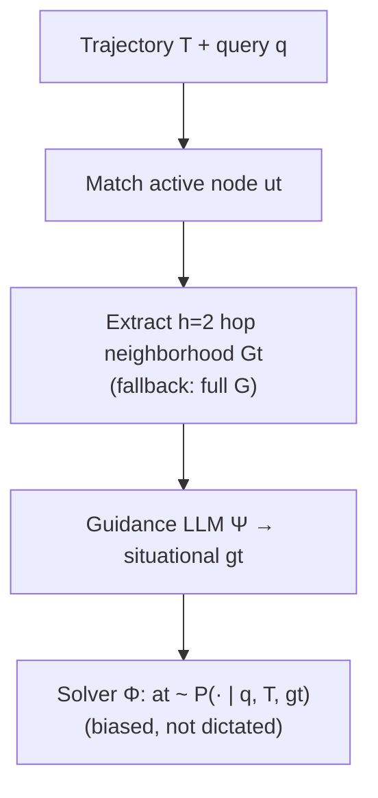
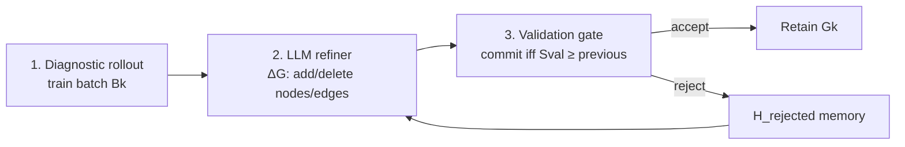

# Procedural Graphs

**Full title:** Procedural Graphs: Self-Evolving Execution Structures for LLM Agents  
**Authors:** Yuxing Lu, Yicheng Chen, Shanchan Wu, Sercan Ö. Arık (Google / Georgia Tech / Peking)  
**arXiv:** [2609.09153](https://arxiv.org/abs/2609.09153) · **PDF:** [arxiv.org/pdf/2609.09153](https://arxiv.org/pdf/2609.09153)  
**DAIR:** [academy.dair.ai/papers/…](https://academy.dair.ai/papers/procedural-graphs-self-evolving-execution-structures-for-llm-agents-2609.09153)  
**Week:** September 7 – September 13, 2026 (DAIR Papers of the Week — rank #1 unread)

> Companion short summary: [`SUMMARY.md`](SUMMARY.md). Resources: [`RESOURCES.md`](RESOURCES.md).

---

## Problem / motivation

LLM agents usually select actions via unconstrained generation over a flat, growing trajectory. Procedural knowledge — *what to do, in what order, under which conditions* — stays implicit. As horizons lengthen, agents lose objectives, call tools out of order, and loop.

Textual memory / guidelines help but still leave transitions disconnected. Hand-designed workflows are explicit but costly. **Procedural Graphs (PG)** organize procedure as editable `(procedure, relation, procedure)` triplets — the procedural analogue of knowledge-graph triplets — and couple them with online generative guidance plus offline self-evolution.

---

## Method and architecture

### Formal graph

```
G = (V, R, E, Φ),   E ⊆ V × R × V
```

- **Nodes V:** tool actions, reasoning steps, states (`Start` / `End`)
- **Edges E:** admissible transitions with relation label `r`
- **Attributes Φ(e):** textual `condition`, `guidance`, `pitfalls`


### Online generative guidance (§3.2)



At each step: `ut = Match(a_{t-1}, V)`; retrieve `Gt = N_h(ut)` (paper default `h=2`, traj window `w=3`); Ψ translates edge attributes into situational guidance; the ReAct solver stays free to reason.

### Offline self-evolution (§3.3)



Attribute edits = delete edge + re-add with revised Φ. Rejected candidates are retained so the refiner does not propose them twice. The loop can start from a **minimal skeleton** or **repair a flawed expert prior**.

---

## Key design decisions (from the paper)

1. **Soft guidance, not hard workflows** — gt biases the solver prompt; actions are not dictated.
2. **Localized subgraph > full-graph dump** — connected `h=2` neighborhood preserves prerequisites and cuts tokens vs full-graph generative guidance (Table 3).
3. **Validation gating** — commit only if held-out `Sval` matches or improves.
4. **Rejection memory** — unsuccessful ΔG stay in `H_rejected` as negative constraints.
5. **Evolution from scratch can beat hand-designed graphs**; the same loop repairs flawed expert priors (MultiChallenge Mode 1 → Mode 3: 58.93% → 92.86%).

---

## Paper results (real numbers)

| Highlight | Result |
|-----------|--------|
| Main table | PG first / joint-first in **21 / 24** model–benchmark settings (sign test p = 4.3×10⁻⁴) |
| BFCL v3 · Gemini 3.5 Flash | **67.00%** vs best baseline 58.00% (+9.0) |
| GDPval · Gemini 3.1 Pro | **78.78** vs 71.37 (+7.41) |
| τ-bench · Gemini 3.1 Pro | **80.00%** vs 73.04% (+6.96) |
| HotpotQA Mode 5 (scratch+evolve) | Ans F1 **78.79** vs unguided 71.21 |
| MultiChallenge Mode 3 (repair expert) | **92.86%** vs flawed expert 58.93% |
| EnterpriseArena survival (Claude) | **58%** vs baseline 44% |
| Ablation (subgraph generative) | MultiChallenge 89.31 / GDPval 63.99 / ALFWorld 81.53 |

---

## How this repo maps onto the paper

| Paper piece | Our code |
|-------------|----------|
| G = (V,R,E,Φ) + Φ fields | `src/procedural_graphs/{schemas,graph}.py` |
| Match / N_h / Ψ guidance | `src/procedural_graphs/guidance.py` |
| Solver Φ (ReAct) | `src/procedural_graphs/solver.py` |
| Refiner ΔG + H_rejected + gate | `src/procedural_graphs/refiner.py` |
| Evolution Algorithm 1 | `src/procedural_graphs/loop.py` |
| Mini tool-use env | `src/procedural_graphs/env.py` + `tasks/mini_shop/` |
| MockLLM CPU / HF GPU | `src/procedural_graphs/runtime.py` |
| Seed graphs | `graphs/skeleton.json`, `graphs/flawed_expert.json` |
| RunPod wrappers | `runpod/` |

**Honest scope:** CPU demo fully runs no-graph / static / evolved comparisons plus K=3 self-evolution with MockLLM on a shopping tool-use toy. GPU path loads **Qwen2.5-7B-Instruct** via transformers for the same mini bench. This is a **faithful research scaffold**, not a reproduction of HotpotQA / ALFWorld / τ-bench / EnterpriseArena or closed Claude/Gemini/Grok runs.

---

## Base model choice

**Default: [`Qwen/Qwen2.5-7B-Instruct`](https://huggingface.co/Qwen/Qwen2.5-7B-Instruct).**

Rationale: open weights; fits a single **~24GB** consumer GPU (RTX 4090 / A6000 / L40) in bf16; strong enough for meaningful multi-role agent loops (solver + guidance + refiner); small enough that RunPod cost stays practical for daily paper experiments. Optional heavier alt: **`Qwen/Qwen2.5-14B-Instruct`** on **A100 80GB**.

CPU demos use **MockLLM** (no torch).

---

## Quickstart

```bash
# Install (CPU demo needs only pyyaml / editable package)
pip install -e .

# CPU demo — MockLLM, K=3, no torch
bash experiments/run_cpu_demo.sh
# or: python demos/cpu_pg_demo.py

# Resource table (no GPU)
python scripts/estimate_resources.py

# GPU smoke / mini evolve (HARD GATE without CUDA — use on RunPod)
bash experiments/run_smoke.sh
bash experiments/run_mini_evolve.sh
```

RunPod (manual; **do not** auto-create paid pods):

```bash
bash runpod/00_create_pod.example.sh   # example only — edit first
bash runpod/01_setup_env.sh
bash runpod/03_run_smoke.sh
bash runpod/04_run_mini_evolve.sh
bash runpod/99_stop_pod.example.sh     # example only
```

---

## Package layout

```
procedural-graphs/
  README.md SUMMARY.md RESOURCES.md IMPLEMENTATION_NOTES.md
  requirements.txt pyproject.toml .gitignore
  src/procedural_graphs/   # graph, guidance, solver, refiner, loop, env, runtime, …
  demos/cpu_pg_demo.py
  experiments/             # lib_common, run_*.sh, run_gpu_experiment.py, configs/
  tasks/mini_shop/
  graphs/                  # skeleton + flawed expert priors
  runpod/                  # 00..04 + 99_stop examples
  scripts/estimate_resources.py
  artifacts/
```
