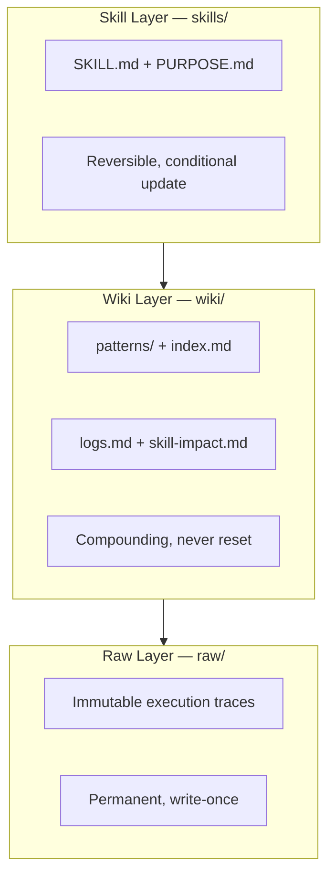
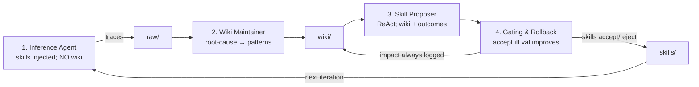

# WikiSkill

**Full title:** WikiSkill: Compiling Agent Experience into Persistent Knowledge for Skill Evolution  
**Authors:** Liyan Tang, Cyrus Rashtchian, Chun-Sung Ferng, Andrew Tomkins, Da-Cheng Juan, Tu Vu (Google Research / Virginia Tech)  
**arXiv:** [2608.27454](https://arxiv.org/abs/2608.27454) · **PDF:** [arxiv.org/pdf/2608.27454](https://arxiv.org/pdf/2608.27454)  
**Week:** August 31 – September 6, 2026 (DAIR Papers of the Week — #3 after Declarative Attention and Harness-of-Harness)

> Companion short summary: [`SUMMARY.md`](SUMMARY.md). Resources: [`RESOURCES.md`](RESOURCES.md).

---

## Problem / motivation

Skill-evolution agents improve by proposing procedural skills from execution traces, then gating changes on a validation set. Prior loops (**Trace2Skill**, **EvoSkill**, **SkillOpt**) discard most of the experience that does not become a skill: rejected proposals, recurring failure modes, and cross-iteration history are forgotten. That makes later proposals myopic and causes inconsistent gains across models and datasets.

**WikiSkill**’s claim: co-evolve a **persistent wiki** (compounding, never reset) alongside a **reversible skill set** (gated and rolled back when validation does not improve). The wiki is the long-term memory that makes skill proposals reliable.

---

## Method and architecture

### Three-layer workspace (different write rules)



| Layer | Path | Write rule | Contents |
|-------|------|------------|----------|
| Raw | `raw/` | **Write-once** | Full rollouts (reasoning, prediction, gold, pass/fail) |
| Wiki | `wiki/` | **Compounding, never reset** | `patterns/*.md`, `index.md`, `logs.md`, `skill-impact.md` |
| Skills | `skills/` | **Reversible** | Per-skill `SKILL.md` + `PURPOSE.md` |

### Four-step evolutionary loop



```
Input:  empty skills S0, empty wiki W0, D_train / D_val / D_test
R_best ← Eval(S0, D_val)
for k = 1 .. K:
  T_train,k ← Inference(D_train; S_{k-1})          # write raw/  (no wiki access)
  W'_k     ← WikiMaintainer(W_{k-1}, sample(T_train,k))
  P_k      ← SkillProposer(W'_k, S_{k-1}, outcomes)  # atomic create/update
  S'_k     ← Apply(S_{k-1}, P_k)
  R        ← Eval(S'_k, D_val)
  if R > R_best:  S_k ← S'_k; R_best ← R
  else:           S_k ← S_{k-1}                     # rollback skills only
  W_k ← UpdateImpact(W'_k, P_k, R, accept/reject)   # wiki NEVER rolled back
  if R_best = 1.0: break
return Eval(S_K, D_test)
```

**Ablation (paper §5.1):** Inference must **not** read the wiki during training rollouts (wiki access during inference *hurts* final skill quality). The Skill Proposer **should** read the wiki (+15.0 Avg when Inference has no wiki).

---

## Key design decisions (from the paper)

1. **Persistent wiki is critical** — without it, the proposer cannot resolve intricate recurring failures.
2. **Inference ≠ Proposer context** — skills only for Inference; wiki for Maintainer/Proposer.
3. **Atomic proposals** — one skill create/update per iteration; easier gating attribution.
4. **Validation gating with rollback** — skills are conditional; wiki is not.
5. **Skill-impact audit trail** — rejected diffs stay in `skill-impact.md` so they are not re-proposed blindly.
6. **Full skill injection** — active skills are pasted into the Inference system prompt (no retrieval confounds).

---

## Paper results (real numbers — Table 1 averages)

| Model | No skill | WikiSkill |
|-------|----------|-----------|
| Qwen-3.5-4B | 26.2 | **38.5** |
| Qwen-3.5-9B | 29.9 | **47.4** (beats Qwen-3.6-27B no-skill **39.4**) |
| Qwen-3.6-27B | 39.4 | **63.3** |
| Gemma-4-31B | 41.3 | **54.9** |
| Gemini-3.5-Flash | 49.5 | **68.1** |

Qwen family relative gains ≈ **+12.3 / +17.5 / +23.9** points (4B / 9B / 27B).  
Gemini LiveMath **33.0 → 72.6**; SpreadSheet **50.5 → 76.6**.  
Transfer: Qwen-3.5-9B with 27B-evolved skills **70.2%** vs self-evolved **63.4%** on ALFWorld.  
Ablation: persistent wiki is critical.

---

## How this repo maps onto the paper

| Paper piece | Our code |
|-------------|----------|
| Three-layer workspace | `src/wikiskill/{traces,wiki,skills}.py` |
| Inference Agent (§3.2.1) | `src/wikiskill/inference.py` |
| Wiki Maintainer (§3.2.2) | `src/wikiskill/maintainer.py` |
| Skill Proposer (§3.2.3) | `src/wikiskill/proposer.py` |
| Gating & Rollback (§3.2.4) | `src/wikiskill/gating.py` |
| Outer loop Algorithm 1 | `src/wikiskill/loop.py` |
| MockLLM CPU path | `src/wikiskill/runtime.py` + `demos/cpu_wikiskill_demo.py` |
| Mini LiveMath-inspired bench | `tasks/mini_livemath/` |
| GPU driver + YAML | `experiments/` |
| RunPod wrappers | `runpod/` |

**Honest scope:** the CPU demo fully runs the four-step loop with MockLLM so wiki patterns and skills visibly evolve (baseline val ~0.25 → ~1.0 by K=3 on the mini split). The GPU path loads **Qwen2.5-7B-Instruct** via transformers for the same mini bench. This is a **faithful research scaffold**, not a reproduction of the paper’s full LiveMath / SealQA / SpreadSheet / OfficeQA / ALFWorld suite or closed Gemini runs.

---

## Base model choice

**Default: [`Qwen/Qwen2.5-7B-Instruct`](https://huggingface.co/Qwen/Qwen2.5-7B-Instruct).**

Rationale: open weights; fits a single **~24GB** GPU (RTX 4090 / A6000 / L40) in bf16 with careful settings; strong enough for meaningful skill-evolution loops; Qwen-family alignment with the paper’s open-weight experiments. Optional heavier alt: **`Qwen/Qwen2.5-14B-Instruct`** on **A100 80GB** (`experiments/configs/alt_14b_qwen25_instruct.yaml`).

CPU demos use **MockLLM** (no torch).

---

## Quickstart

```bash
# Install (CPU demo needs only pyyaml / editable package)
pip install -e .

# CPU demo — MockLLM, K=3, no torch
bash experiments/run_cpu_demo.sh
# or: python demos/cpu_wikiskill_demo.py

# Resource table (no GPU)
python scripts/estimate_resources.py

# GPU smoke (HARD GATE without CUDA — use on RunPod)
bash experiments/run_smoke.sh
bash experiments/run_mini_evolve.sh
```

RunPod (manual; **do not** auto-create paid pods):

```bash
bash runpod/00_create_pod.example.sh   # example only — edit first
bash runpod/01_setup_env.sh
bash runpod/03_run_smoke.sh
bash runpod/04_run_mini_evolve.sh
bash runpod/99_stop_pod.example.sh     # example only
```

---

## Package layout

```
wikiskill/
  README.md SUMMARY.md RESOURCES.md PENDING_PUSH.md IMPLEMENTATION_NOTES.md
  requirements.txt pyproject.toml .gitignore
  src/wikiskill/     # loop, inference, maintainer, proposer, gating, wiki, skills, traces, runtime
  demos/cpu_wikiskill_demo.py
  experiments/       # lib_common, run_*.sh, run_gpu_experiment.py, configs/
  tasks/mini_livemath/
  runpod/            # 00..04 + 99_stop examples
  scripts/estimate_resources.py
  artifacts/
```
